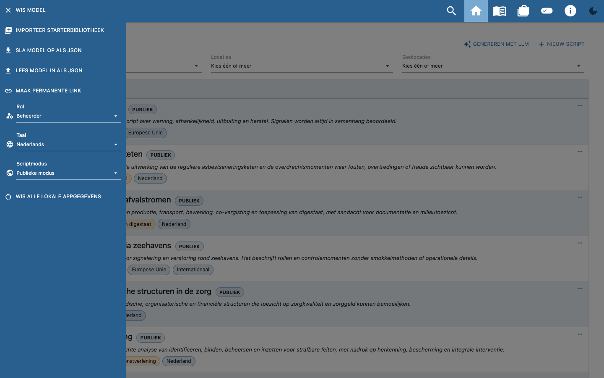
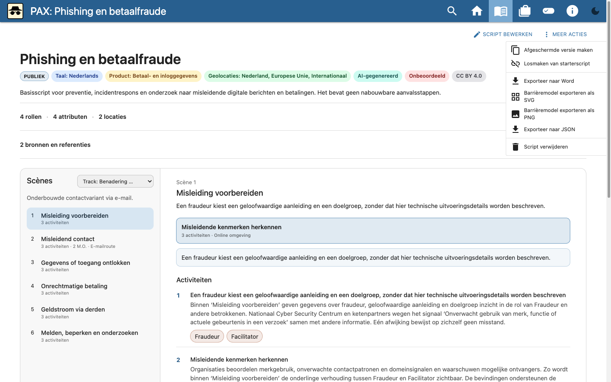
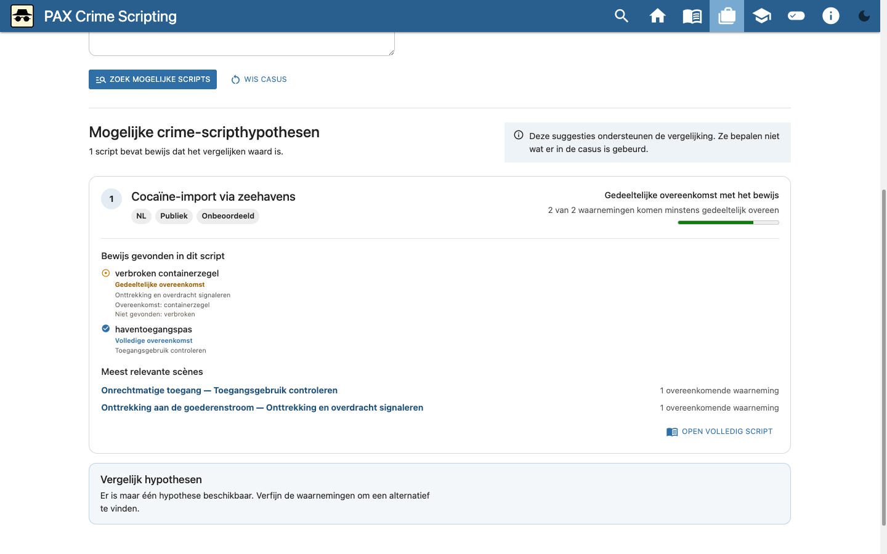
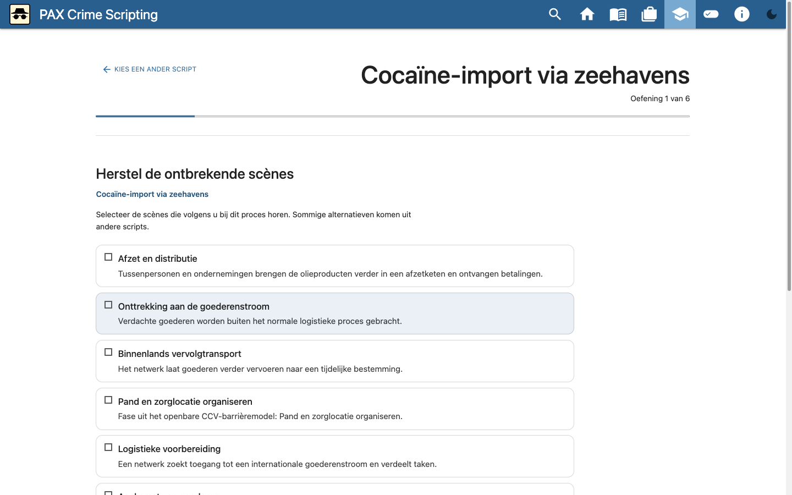

# PAX gebruikershandleiding

Deze handleiding beschrijft het menu, delen en inlezen, de normale
gebruikersroute, het bewerken van een crime script en de LLM-wizard. De beelden
zijn gemaakt met openbare starterinhoud en synthetische testgegevens.

<!-- PAX_GUIDE_VIDEO -->

## 1. Menu, rol, taal en scriptmodus

PAX bewaart de werkruimte lokaal in de browser. Kies bij de eerste start de
Nederlandse starterbibliotheek, een lege werkruimte of een eigen JSON-model.
Open het menu linksboven om de werkruimte en weergave in te stellen.

Kies eerst de rol die past bij je taak:

- **Gebruiker**: scripts bekijken, doorzoeken en exporteren.
- **Redacteur**: ook bestaande scripts bewerken en verwijderen.
- **Beheerder**: daarnaast scripts maken, de LLM-wizard gebruiken en gedeelde
  taxonomie zoals rollen, attributen en locaties bewerken.

Je kunt dus pas een script bewerken nadat je **Redacteur** of **Beheerder**
kiest. Rollen en andere gedeelde taxonomie kun je alleen als **Beheerder**
toevoegen of wijzigen. De rolkeuze is prototypegedrag in de browser en geen
authenticatie of toegangsbeveiliging.

Met **Taal** kies je de taal van de interface en van een later ingelezen
starterbibliotheek. Bestaande scripts worden niet automatisch vertaald.

Gebruik **Scriptmodus** om te wisselen tussen:

- **Publieke modus**: toont en exporteert alleen publieke scripts.
- **Afgeschermde modus**: toont waar beschikbaar de afgeschermde tegenhanger.
  Export vraagt extra bevestiging; een permanente link is niet beschikbaar als
  het model afgeschermde inhoud bevat.

Ook de scriptmodus is geen toegangsbeveiliging. Deel afgeschermde informatie
alleen via een passend beveiligd kanaal.

## 2. Importeren, exporteren en delen

Het menu bevat acties voor de hele werkruimte:

- **Sla model op als JSON** maakt een bewerkbare export van de collectie. In
  publieke modus bevat die alleen publieke scripts.
- **Lees model in als JSON** maakt het gekozen bestand de huidige lokale
  werkruimte. Exporteer de bestaande werkruimte eerst als die behouden moet
  blijven.
- **Maak permanente link** kopieert een URL waarin het publieke model is
  opgenomen. De ontvanger opent daarmee een kopie in de eigen browser.
  Permanente links zijn uitgeschakeld voor modellen met afgeschermde inhoud.

Voor één script open je **Meer acties** bij dat script:

- **Exporteer naar JSON** maakt een bewerkbaar bestand met het script en de
  benodigde taxonomie.
- **Exporteer naar Word** maakt een leesrapport; dit is geen bewerkbaar
  PAX-model.

De ontvanger kiest **Lees model in als JSON** om een collectie- of
scriptbestand te openen. Dit vervangt de huidige lokale werkruimte en voegt
niet automatisch samen. Controleer vóór delen altijd classificatie en
bestandsnaam en gebruik voor afgeschermde bestanden een beveiligd kanaal.

## 3. Een script bekijken

1. Zoek of filter een script op de startpagina.
2. Open het script door de kaart of **meer**-actie te kiezen.
3. Kies een track als het script meerdere routes bevat.
4. Kies bij een scène een modus operandi om een alternatief procespad te zien.
5. Gebruik de rol-pillen onder activiteiten om activiteiten voor één rol te
   markeren.
6. Open een pill onder **Gerelateerde crime scripts** om direct naar een
   gekoppeld proces te gaan.
7. Klap rollen, attributen, transporten, locaties en bronnen open als die
   details nodig zijn.

## 4. Een script bewerken

Kies **Script bewerken**. De editor bestaat uit een scène-overzicht en het
detail van de geselecteerde scène.

1. Open **Scriptgegevens** om titel, beschrijving, taal, classificatie,
   producten, geografie en referenties te wijzigen.
2. Voeg scènes toe of wijzig de volgorde in het overzicht.
3. Bewerk per scène de modus operandi, beschrijving en locatie.
4. Voeg activiteiten toe en koppel rollen, attributen, transporten en zo nodig
   één of meer gerelateerde crime scripts. Alleen scripts die in de actieve
   publieke of afgeschermde modus beschikbaar zijn, kunnen worden gekozen.
5. Voeg indicatoren, maatregelen en andere beschikbare taxonomie toe.
6. Gebruik de track-editor om per scène de gewenste modus operandi te kiezen.
7. Controleer het resultaat in de viewer. PAX bewaart wijzigingen lokaal.

Gebruik **Meer acties** voor JSON- en Word-export, import en andere
scriptacties. Bewaar vóór ingrijpende wijzigingen een JSON-export als
herstelpunt.

## 5. Een casus verkennen

Open **Casus** en voer concrete waarnemingen in, één per regel of gescheiden
door komma's. PAX vergelijkt deze lokaal met de beschikbare crime scripts.
Geselecteerde producten, locaties, rollen, attributen en transportmiddelen
gelden als vereisten; laat ze leeg wanneer ze onzeker zijn.

Per hypothese zie je:

- hoeveel waarnemingen volledig of gedeeltelijk overeenkomen;
- welke termen wel en niet zijn gevonden;
- in welke scènes de overeenkomsten voorkomen;
- welke ingevoerde waarnemingen niet zijn verklaard.

Een overeenkomst is een startpunt voor analyse, geen conclusie over wat er is
gebeurd. Vergelijk waar mogelijk twee of drie hypothesen en leg vast welke
aanvullende informatie het onderscheid kan maken.

## 6. Oefenen in de leermodus

Open **Leermodus** en kies een publiek referentiescript. Zonder eigen selectie
gebruikt PAX de starterbibliotheek. Oefeningen laten scènes en activiteiten
aanvullen of ordenen en vragen om passende rollen, indicatoren of barrières.
Keuzeopties kunnen ook uit andere scripts komen.

Na **Vergelijk met referentie** toont PAX overeenkomsten en verschillen. Een
afwijkend antwoord wordt niet automatisch fout genoemd: andere keuzes kunnen
ook verdedigbaar zijn en horen aanleiding te geven tot reflectie. Let bij
onbeoordeelde starters op de waarschuwing dat het referentiescript
leermateriaal is en geen vaststaande waarheid.

## 7. Een script voorbereiden met de LLM-wizard

Kies op de startpagina **Genereren met LLM**. PAX gebruikt een handmatige,
provider-neutrale overdracht: de toepassing benadert geen LLM, bewaart geen
API-sleutel, opent geen bron-URL en verstuurt geen werkruimtegegevens.

### Stap 1 — Opdracht

Vul in:

- taal van het script;
- criminaliteitsvorm of domein;
- geografische toepasbaarheid;
- detailniveau;
- optionele bron-URL's, één per regel;
- optionele geplakte brontekst of notities.

URL's worden exact in de prompt opgenomen, maar nooit door PAX geopend of
gedownload. Neem geen geheime of herleidbare gegevens op in een prompt voor een
externe dienst.

### Stap 2 — Prompt kopiëren

Kies **Prompt maken** en controleer de gegenereerde prompt. Kopieer die zelf
naar een LLM naar keuze. De prompt vraagt om defensieve analyse en sluit
uitvoerbare delictinstructies en ontwijkingstactieken uit.

### Stap 3 — JSON plakken

Kopieer uitsluitend het JSON-antwoord van het LLM terug naar PAX. De wizard
parseert en valideert het antwoord lokaal. Een foutmelding benoemt het veld of
de ontbrekende verwijzing; pas het antwoord buiten PAX aan en probeer opnieuw.

De afbeelding gebruikt reproduceerbare synthetische JSON. Het gebruikte LLM
maakt niet uit voor deze handmatige, provider-neutrale overdracht.

### Stap 4 — Controleren en importeren

Controleer vóór import:

- titel, taal en classificatie;
- scènes, modi operandi en activiteiten;
- rollen, locaties, indicatoren en maatregelen;
- bronnen en brongebruik;
- de afwezigheid van operationele delictinstructies.

De werkruimte verandert pas na de expliciete importbevestiging. Een
geïmporteerd script blijft **AI-gegenereerd** en **Onbeoordeeld** totdat een
mens het inhoudelijk heeft beoordeeld.

## 8. Veilig uitwisselen en herstellen

- Exporteer de volledige werkruimte als JSON voor een lokaal herstelpunt vóór
  je een ander model inleest.
- Gebruik een script-JSON voor gerichte review en uitwisseling en een
  collectie-JSON om een volledige werkruimte over te dragen.
- Behandel een permanente link als gevoelige informatie: het publieke model
  staat gecodeerd in de URL.
- Controleer altijd bestandsnaam en classificatie voor delen.
- Wis lokale appgegevens alleen nadat een bruikbaar herstelbestand is
  gecontroleerd.
