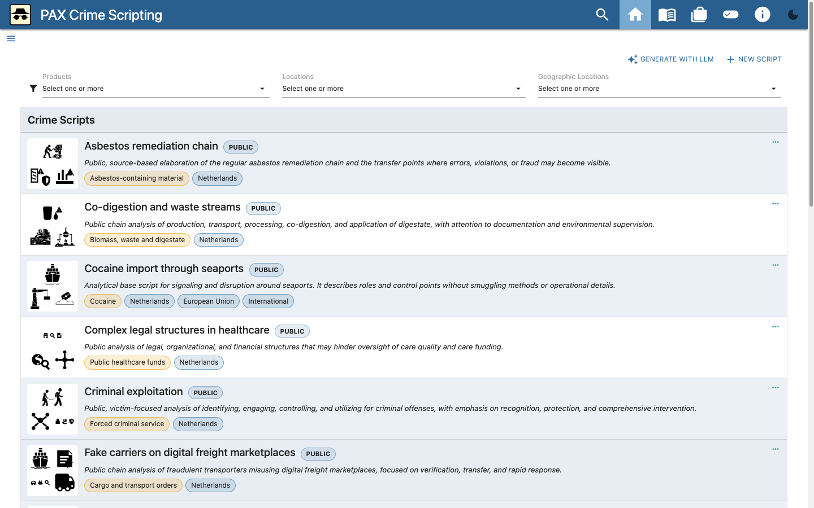

# PAX user guide

This guide covers the standard user journey, editing a crime script, and the
LLM wizard. The images use public starter content and synthetic test data.

<!-- PAX_GUIDE_VIDEO -->

## 1. Workspace and script mode

PAX stores the workspace locally in the browser. On first use, choose the
English starter library or an empty workspace. Use **Script mode** to switch
between:

- **Public mode**: shows and exports public scripts only.
- **Restricted mode**: can also show restricted scripts. Exporting and sharing
  require additional confirmation; a permanent link is unavailable while the
  workspace contains restricted content.

The selected mode is not a substitute for access control. Share JSON or Word
exports only through an appropriately secured channel.

## 2. View a script

1. Search for or filter a script on the home page.
2. Open it by selecting the card or the **more** action.
3. Select a track when the script contains multiple routes.
4. Select a modus operandi in a scene to view an alternative process route.
5. Use the role pills below activities to highlight activities for one role.
6. Open a pill under **Related crime scripts** to navigate directly to a
   linked process.
7. Expand roles, attributes, transports, locations, and sources when those
   details are needed.

## 3. Edit a script

Select **Edit script**. The editor contains a scene overview and details for
the selected scene.

1. Open **Script details** to change the title, description, language,
   classification, products, geography, and references.
2. Add scenes or change their order in the overview.
3. Edit each scene's modus operandi, description, and location.
4. Add activities and link roles, attributes, transports, and, where needed,
   one or more related crime scripts. Only scripts available in the active
   public or restricted mode can be selected.
5. Add indicators, measures, and other available taxonomy.
6. Use the track editor to select the required modus operandi for each scene.
7. Check the result in the viewer. PAX stores changes locally.

Use **More actions** for JSON and Word export, import, and other script
operations. Before substantial changes, save a JSON export as a recovery point.

## 4. Prepare a script with the LLM wizard

Select **Generate with LLM** on the home page. PAX uses a manual,
provider-neutral hand-off: the application does not contact an LLM, store an
API key, open a source URL, or transmit workspace data.

### Step 1 — Brief

Enter:

- the script language;
- crime type or domain;
- geographical applicability;
- level of detail;
- optional source URLs, one per line;
- optional pasted source text or notes.

URLs are included verbatim in the prompt, but PAX never opens or downloads
them. Do not include secret or identifiable information in a prompt sent to an
external service.

### Step 2 — Copy prompt

Select **Build prompt** and check the generated prompt. Copy it to an LLM of
your choice. The prompt requests defensive analysis and excludes actionable
offending instructions and evasion tactics.

### Step 3 — Paste JSON

Copy only the LLM's JSON response back into PAX. The wizard parses and
validates it locally. An error identifies the field or missing reference;
correct the response outside PAX and try again.

The image uses reproducible synthetic JSON. The selected LLM does not matter
for this manual, provider-neutral hand-off.

### Step 4 — Review and import

Before importing, check:

- title, language, and classification;
- scenes, modi operandi, and activities;
- roles, locations, indicators, and measures;
- sources and how they were used;
- the absence of operational offending instructions.

The workspace changes only after explicit import confirmation. An imported
script remains **AI-generated** and **Unreviewed** until a person has completed
a substantive review.

## 5. Import, export, and recovery

- Export the complete workspace as JSON for a local recovery point.
- A script JSON file is suitable for focused review and exchange.
- A Word export is a reading report, not a complete replacement for editable
  JSON.
- Always check the filename and classification before sharing.
- Clear local application data only after verifying a usable recovery file.
